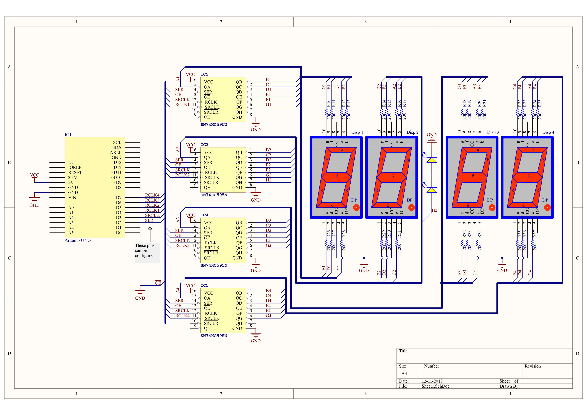
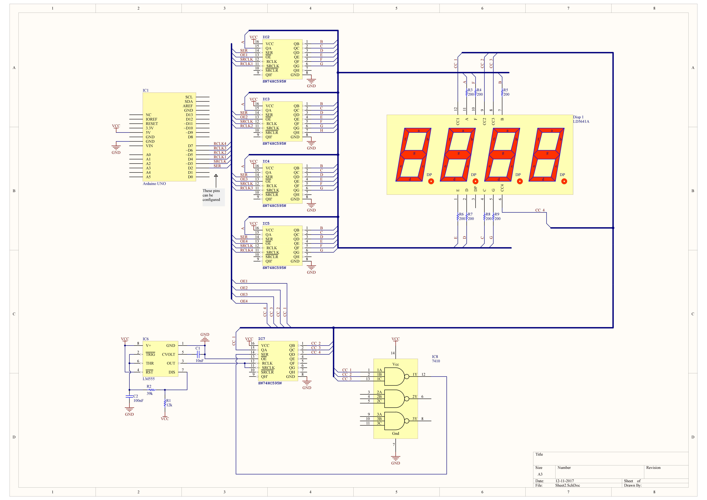

# Arduino-clock
Ik heb de "TM1637Display" library vervangen door "Display" library. Deze nieuwe library heeft dezelfde functies als de oude dus er is bijna niets aan de originele code veranderd buiten de setup.

## Display library
### Setup
In de header van de code zal je:
```c++
// Display variables
uint8_t SER   = 2;                    // Pin 2 connected to the serial pins of all four shift registers
uint8_t SRCLK = 3;                    // Pin 3 connected to the Shift register clock pins of all four shift registers
uint8_t RCLK1 = 4;                    // Pin 4 connected to the storage clock of the shift register controlling the left most display
uint8_t RCLK2 = 5;                    // Pin 5 connected to the storage clock of the shift register controlling the second from the left display
uint8_t RCLK3 = 6;                    // Pin 6 connected to the storage clock of the shift register controlling the third from the left display
uint8_t RCLK4 = 7;                    // Pin 7 connected to the storage clock of the shift register controlling the fourth from the left display
bool CC       = true;                 // Display type (CC == true => common cathode; CC == false => common anode)
```
terugvinden. Dit zijn de pinnen die de nieuwe library gebruikt maar je kan ze natuurlijk nog altijd veranderen als je wilt.

## Anderer pinnen
Ik heb ook de pinnen van de andere aangsloten sensors verplaatst zodat ik de pinnen voor het display naast elkaar kon zetten. Deze pinnen zijn nu:
```
// Encoder variables
byte encoderPinSW = 8;
byte encoderPinB = 9;
byte encoderPinA = 10;

int PIR = 11;
int BUZ = 12;

#define DHT11_PIN A0
```

## Aansluiting van de componenten
Ik heb twee voorbeelden gemaakt over hoe je het display kan maken. Bijde voorbeelden nemen aan dat je een common cathode display hebt, een kleine aanpasing zal nodig zijn als je toch een common annode diplay hebt.

### Optie 1


### Optie 2


#### Gebruikte links (niet belangrijk):
* https://create.arduino.cc/projecthub/lagsilva/complete-digital-clock-including-alarm-and-motion-sensor-da6b59
* https://github.com/avishorp/TM1637/blob/master/TM1637Display.h
* http://www.ti.com/lit/ds/symlink/sn74hc595.pdf
* https://cdn-shop.adafruit.com/datasheets/BL-Q39A-42.PDF
* https://www.arduino.cc/en/Hacking/LibraryTutorial
* https://www.arduino.cc/en/Reference/BitRead
